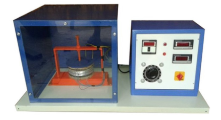
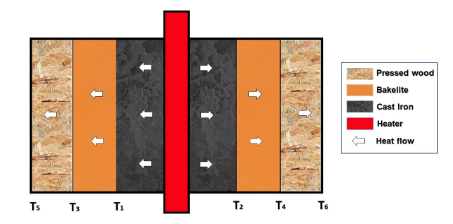

## INTRODUCTION 

#### User Objectives and Goals:

To determine the total thermal resistance of the composite slab

To determine the total thermal conductivity of the composite slab.

To plot the temperature vs distance graph

#### Theory

Many engineering applications of practical utility involve heat transfer through a medium composed of two or more materials of different thermal conductivities arranged in series or parallel. Consider for example the walls of a refrigerator, hot cases, cold storage plants, hot water tanks etc., which always have insulating materials between the inner and the outer wall. A hot fluid flow inside the tube covered with a layer of thermal insulation is an example of composite system because in this case the thermal conductivities of tube metal insulation are different. The experimental setup of a composite slab apparatus is shown in Fig 1.

  
Fig 1. Composite Slab Apparatus

  
Fig 2. Direction of heat flow in a composite slab

A simple method for determining an overall heat transfer coefficient that is useful to find the heat transfer between simple elements such as walls in buildings or across heat exchangers is shown below. Note that this method only accounts for conduction within materials as shown in Fig 2, it does not consider heat transfer through methods such as radiation. The method is as follows:

1/U= L1/K1 + L2/K2 + L3/K3 + …….

The problem of heat transfer through the composite system can be solved by the application of thermal resistance concept. The procedure for solving one dimensional, steady state heat conduction problems for composite system comprising parallel plates, co-axial cylinders or concentric spheres are dealt here.

Conduction is a process of heat transfer through solids. For a given temperature difference between the surfaces, the rate of heat transfer (Q, watts) depends upon the coefficient of thermal conductivity of the substance (k, W/mK), area of heat transfer (A, m2) and the temperature difference (ΔT, 0C)between the surfaces and thickness of the material (Δ X, m) according to the equation,

Q = - kA (Δ T/ Δ X)

Substances such as metals conduct more heat and have high values of co-efficient of thermal conductivity, as high as about 200 watts/m „C, insulating materials conduct less heat and have low values of co-efficient of thermal conductivity, say about 0.1 to 1 watts/m0C. In circumstances where heat loss from the system must be minimized, such as in power plant transmission lines, furnaces, etc. It is essential to cover heat carrying systems with proper materials. This set-up has been designed to study heat through composite materials

#### Equations/formulas:

Heat input, Q (W) = VI/2

Ta avg = (T1 + T2)/2 °C

Tb avg = (T3 + T4)/2 °C

Tc avg = (T5 + T6)/2 °C

Those average temperatures are used to calculate temperature differences between the slabs i.e. given material ∆T.

Area of Slab, A (m2) =(Ⅱd^2)/4, where d is the diameter of slab.

Thermal Resistance of Slab, R (°C/W) = ∆T/Q

For first slab,

R1 = (Ta avg-Tb avg)/Q
Similarly, for others slabs and for last one we need to use outside temperature as for ∆T calculations.
Thermal Conductivity, K (W/mK) = Qt/AΔT , where t is the thickness of slab

For first slab,

R1 = Qt/((Ta avg-Tb avg)\*A)
Similarly for others slabs and for last one we need to use outside temperature as for ∆T calculations.

Overall heat Transfer coefficient (U)

U = 1/(L1⁄K1) + 1/(L2⁄K2) + 1/(L3⁄K3)
